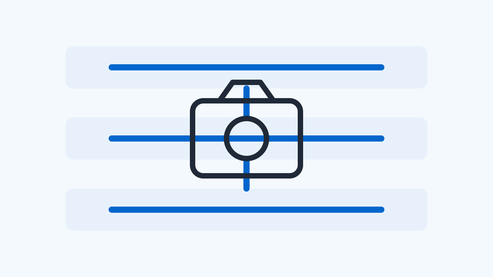

# 2026 W29 (07.06 ~ 07.13)

이번 주에는 ‘Qualcomm CAMSS, 오프라인 이미지 처리를 가속하는 OPE 드라이버 v4 패치 제안’, ‘libcamera 소프트웨어 ISP, 렌즈 쉐이딩 보정(LSC) 강화를 위한 EGL 텍스처 필터 파라미터 도입’ 등 3건의 소식을 다룹니다.

## 1. 이번 주 기사

- Qualcomm CAMSS, 오프라인 이미지 처리를 가속하는 OPE 드라이버 v4 패치 제안
- libcamera 소프트웨어 ISP, 렌즈 쉐이딩 보정(LSC) 강화를 위한 EGL 텍스처 필터 파라미터 도입
- Raspberry Pi, libcamera v0.7.1+rpt20260609 다운스트림 버전 배포

## 2. Qualcomm CAMSS, 오프라인 이미지 처리를 가속하는 OPE 드라이버 v4 패치 제안

_lore.kernel.org linux-media 메일링 리스트 패치 분석_

Qualcomm CAMSS(Camera Subsystem)에 오프라인 이미지 처리를 전담하는 OPE(Offline Processing Engine) 드라이버를 추가하는 v4 패치가 제안되었습니다.

이번 주 리눅스 미디어 메일링 리스트를 통해 Qualcomm CAMSS 드라이버 스택에 Offline Processing Engine(OPE) 지원을 추가하는 네 번째 패치 시리즈가 공개되었습니다. OPE는 raw Bayer 프레임을 입력받아 YUV 프레임으로 변환하는 메모리-투-메모리(M2M) 방식의 ISP 하드웨어 블록입니다.

이 드라이버는 하드웨어 수준에서 화이트 밸런스, 디모자이크, 크로마 향상, 색 보정, 다운스케일링 등 핵심적인 ISP 파이프라인 가공을 수행합니다. 기존의 실시간 스트리밍 처리와 달리 오프라인 가속 방식을 취함으로써 카메라 시스템의 유연한 버퍼 처리와 효율적인 자원 분배가 가능해집니다.

다만 본 패치는 현재 리눅스 커널 메인라인에 병합되지 않은 제안 단계(PATCH v4)이므로 실제 상용 칩셋 및 Android 디바이스에 적용되기까지는 벤더의 통합 및 검증 프로세스가 추가로 요구됩니다. HAL 개발자들은 하위 드라이버의 M2M 아키텍처 도입에 따른 버퍼 라이프사이클 변화를 장기적으로 관찰할 필요가 있습니다.

### Camera HAL/Driver 관점에서의 의미

Android Camera HAL에 직접적인 API 변경을 주지는 않으나, 하위 드라이버 레벨에서 RAW-to-YUV 오프라인 변환 경로가 최적화됨에 따라 YUV_420_888 및 RAW 스트림의 동시 처리 효율성과 전력 소모가 개선될 가능성이 있습니다.

**출처**

- [Re: [PATCH v4 6/7] media: qcom: camss: Add CAMSS Offline Processing Engine driver](https://lore.kernel.org/linux-media/da70ed94-fd76-4105-8071-1ed8d8e41d84@linaro.org/)

---

## 3. libcamera 소프트웨어 ISP, 렌즈 쉐이딩 보정(LSC) 강화를 위한 EGL 텍스처 필터 파라미터 도입

_libcamera Patchwork RFC v7 패치 검토_

최근 libcamera의 소프트웨어 ISP EGL 모듈에서 렌즈 쉐이딩 보정(LSC) 성능을 개선하기 위해 createTexture2D() 함수에 필터 파라미터를 추가하는 패치가 제안되었습니다.

지난 7월 8일 제안된 RFC v7 패치 시리즈에 따르면, libcamera의 소프트웨어 ISP(software_isp) 내 EGL 모듈에 중요한 인터페이스 변경이 포함되었습니다. 구체적으로 createTexture2D() 함수에 필터 파라미터가 새롭게 추가되었습니다.

이 변경은 렌즈 주변부의 광량 저하 및 색상 왜곡을 보정하는 렌즈 쉐이딩 보정(LSC) 기능을 소프트웨어 ISP 상에서 정교하게 지원하기 위한 사전 작업입니다. 텍스처 생성 시 필터링 방식을 직접 제어함으로써 보정 데이터의 보간 품질을 높일 수 있게 됩니다.

해당 패치는 아직 검토 단계(RFC v7)에 머물러 있어 메인라인에 완전히 통합되지는 않았습니다. libcamera를 하부 스택으로 활용하는 임베디드 시스템이나 특정 가상화 환경의 Android HAL 개발자들은 소프트웨어 ISP 구동 시의 이미지 품질 향상 여부를 추적할 필요가 있습니다.

### Camera HAL/Driver 관점에서의 의미

Android Camera HAL에 직접적인 영향은 없으나, libcamera 소프트웨어 ISP를 사용하는 플랫폼에서 LSC 보정 품질과 GPU 텍스처 처리 효율성을 동시에 높일 수 있는 기반이 마련되었습니다.

**출처**

- [[RFC,v7,1/6] libcamera: software_isp: egl: Add filter parameter to createTexture2D()](https://patchwork.libcamera.org/patch/27346/)

---

## 지난 소식 (Catch-up)

## 4. Raspberry Pi, libcamera v0.7.1+rpt20260609 다운스트림 버전 배포 (5주 전 릴리스)

_이미지: [Raspberry Pi libcamera Releases](https://github.com/raspberrypi/libcamera/releases/tag/v0.7.1%2Brpt20260609)_

_Raspberry Pi GitHub 공식 릴리스 분석_

지난 2026년 6월 9일, Raspberry Pi가 자사 플랫폼에 최적화된 libcamera v0.7.1+rpt20260609 다운스트림 버전을 공식 릴리스했습니다.

이번 소식은 지난 6월 9일 공개된 Raspberry Pi의 libcamera 프로젝트 다운스트림 릴리스에 대한 회고입니다. 배포된 v0.7.1+rpt20260609 버전은 Raspberry Pi 하드웨어에 특화된 카메라 드라이버 및 이미지 파이프라인 최적화 요소를 담고 있습니다.

libcamera는 리눅스 환경에서 카메라 기기를 추상화하는 핵심 프레임워크로, Raspberry Pi의 다운스트림 버전은 임베디드 리눅스 및 V4L2 서브시스템의 최신 변경 사항을 가장 빠르게 반영하는 창구 역할을 해왔습니다. 이번 릴리스 역시 해당 플랫폼에서의 카메라 구동 안정성을 높이는 데 주안점을 두고 있습니다.

다만 이 릴리스는 Raspberry Pi 특정 하드웨어와 소프트웨어 스택에 초점을 맞추고 있으므로, 일반적인 Android 기기의 Camera HAL3 구현이나 AOSP 프레임워크 계약에는 직접적인 영향을 미치지 않습니다. 임베디드 Android 환경을 다루거나 V4L2 드라이버 통합을 담당하는 엔지니어들이 상류(upstream) 기술 동향을 파악하는 참조 자료로 활용하기에 적합합니다.

### Camera HAL/Driver 관점에서의 의미

Android Camera HAL에 직접적인 API나 계약 변화를 주지는 않으나, V4L2 기반 드라이버 통합 및 임베디드 리눅스 카메라 스택의 최적화 기법을 벤치마킹하는 용도로 참고할 수 있습니다.

**출처**

- [Raspberry Pi libcamera Releases - v0.7.1+rpt20260609](https://github.com/raspberrypi/libcamera/releases/tag/v0.7.1%2Brpt20260609)

## 참고 / 더 읽을거리

- [2. Android skills keep growing (『Top 3 updates for Android developer productivity』)](<https://developer.android.com/tools/agents/android-cli#skills-add>) — Android Developers Blog (Tue, 09 Jun 2026 13:00:00 +0000) · Android 플랫폼 · 카메라 인접 주제 참고
- [Top 3 updates for Android developer productivity](<https://android-developers.googleblog.com/2026/06/android-developer-productivity-updates.html>) — Android Developers Blog (Tue, 09 Jun 2026 13:00:00 +0000) · C++ / AI 네이티브 툴링 참고

## 참고자료

- [Re: [PATCH v4 6/7] media: qcom: camss: Add CAMSS Offline Processing Engine driver](https://lore.kernel.org/linux-media/da70ed94-fd76-4105-8071-1ed8d8e41d84@linaro.org/)
- [[RFC,v7,1/6] libcamera: software_isp: egl: Add filter parameter to createTexture2D()](https://patchwork.libcamera.org/patch/27346/)
- [Raspberry Pi libcamera Releases - v0.7.1+rpt20260609](https://github.com/raspberrypi/libcamera/releases/tag/v0.7.1%2Brpt20260609)
