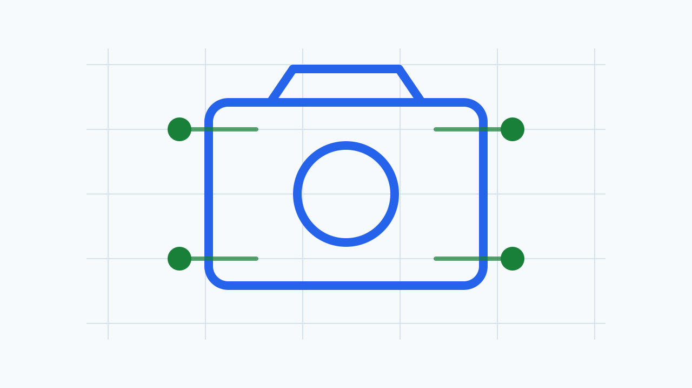

# Camera HAL SW 뉴스레터 - 2026-05-02

이번 주 뉴스레터에서는 Android의 하이브리드 AI 추론 및 새로운 Gemini 모델 지원이 카메라 HAL에 미치는 영향과 Android 17 Beta 4 출시로 인한 플랫폼 호환성 점검의 중요성을 다룹니다. 또한 C++ 네이티브 코드 최적화 및 최신 컴파일러 기능에 대한 심층 분석을 통해 HAL 개발의 성능과 안정성을 강화할 방안을 모색합니다. 마지막으로 Android 보안 업데이트를 통해 HAL의 취약점 관리에 대한 중요성을 강조합니다.

## 1. 이번 주 3줄 브리핑

- Android의 하이브리드 AI 추론 도입은 카메라 HAL이 온디바이스 AI 워크로드를 효율적으로 지원하기 위한 NPU/GPU 및 버퍼 관리 최적화를 요구합니다.
- Android 17 Beta 4 출시에 따라 카메라 HAL은 새로운 API 및 동작 변경 사항에 대한 호환성 테스트와 성능 검증을 우선적으로 수행해야 합니다.
- C++ devirtualization, 정적 다형성, C++26 컴파일러 기능(reflection, contracts)은 HAL 네이티브 코드의 성능, 안전성, 개발 생산성을 향상시킬 기회를 제공합니다.

## 2. AI / Android Camera

### Android 하이브리드 AI 추론 및 새로운 Gemini 모델 지원

_Image: [Android Developers Blog](https://android-developers.googleblog.com/2026/04/Hybrid-inference-and-new-AI-models-are-coming-to-Android.html)_

**이번 주 확인한 사실**

- Firebase API를 통한 하이브리드 추론이 도입되었습니다.
- 온디바이스 및 클라우드 추론을 함께 사용할 수 있습니다.
- 이미지 생성을 위한 새로운 Gemini Nano Banana 모델이 Android에서 지원됩니다.
- 출처: Experimental hybrid inference and new Gemini models for Android

**배경지식**

기존 온디바이스 AI 추론은 장치 리소스 제약으로 인해 복잡한 모델 실행에 한계가 있었습니다. 클라우드 AI는 더 강력하지만 지연 시간과 데이터 프라이버시 문제가 있습니다. 하이브리드 추론은 이 두 가지 장점을 결합하여 최적의 성능과 유연성을 제공합니다. Gemini 모델은 Google의 최신 대규모 언어 모델(LLM) 제품군으로, 특히 Nano 버전은 온디바이스 실행에 최적화되어 있습니다.

**Camera HAL 관점 해석**

HAL은 온디바이스 AI 워크로드를 위해 NPU/GPU 스케줄링 및 리소스 할당을 최적화해야 합니다. 카메라 스트림 버퍼가 AI 추론 엔진으로 효율적으로 전달되고, 추론 결과가 다시 카메라 파이프라인으로 통합될 수 있도록 버퍼 관리 및 동기화 메커니즘을 검토해야 합니다. 새로운 이미지 생성 모델이 요구하는 특정 이미지 포맷, 해상도, 프레임 속도 요구 사항을 HAL이 지원하는지 확인해야 합니다. AI 추론 과정에서 발생하는 지연 시간(latency) 및 전력 소모를 최소화하기 위한 HAL 수준의 최적화 기회를 탐색해야 합니다.

**우리 팀이 확인할 Action Item**

- 이번 달까지 하이브리드 추론 및 Gemini Nano 모델의 카메라 HAL 통합을 위한 초기 기술 스펙을 검토하고, 잠재적 성능 병목 지점을 식별합니다.
- 다음 분기까지 NPU/GPU 리소스 관리 및 버퍼 전달 효율성 개선을 위한 PoC(개념 증명)를 진행합니다.

**팀 공유용 한 줄**

Android의 하이브리드 AI 추론 및 Gemini 모델 지원은 카메라 HAL이 온디바이스 AI 성능을 극대화하고 새로운 이미지 처리 시나리오를 지원하기 위한 NPU/GPU 및 버퍼 관리 최적화를 요구합니다.

**Sources**

- [Experimental hybrid inference and new Gemini models for Android](https://android-developers.googleblog.com/2026/04/Hybrid-inference-and-new-AI-models-are-coming-to-Android.html)

---

## 3. Android Camera / AOSP Camera

### Android 17 Beta 4 출시: 플랫폼 안정성 및 카메라 HAL 호환성 점검

_Image: [Android Developers Blog](https://android-developers.googleblog.com/2026/04/the-fourth-beta-of-android-17.html)_

**이번 주 확인한 사실**

- Android 17 Beta 4가 출시되었습니다.
- 이것은 Android 17 릴리스 주기의 마지막 베타 버전입니다.
- 앱 호환성 및 플랫폼 안정성을 위한 중요한 마일스톤입니다.
- 출처: The Fourth Beta of Android 17

**배경지식**

Android 베타 릴리스는 최종 안정화 버전 출시 전 개발자들이 새로운 플랫폼 변경 사항에 대비하고 호환성 문제를 해결할 수 있도록 돕습니다. 특히 마지막 베타 버전은 최종 릴리스에 매우 근접하므로, 이 단계에서의 테스트는 실제 사용자 경험에 직접적인 영향을 미칩니다. 카메라 HAL은 Android 프레임워크와 하드웨어 사이의 핵심 인터페이스이므로, 플랫폼 변경 사항에 가장 민감하게 반응합니다.

**Camera HAL 관점 해석**

Android 17에서 도입될 수 있는 새로운 카메라 API, 특성(characteristics), 요청(request) 또는 결과(result) 메타데이터 필드를 검토하고 HAL이 이를 올바르게 처리하는지 확인해야 합니다. 기존 카메라 HAL 인터페이스(HIDL 또는 AIDL)의 변경 사항이 있는지 확인하고, 필요한 경우 HAL 구현을 업데이트해야 합니다. 새로운 Android 버전에서 카메라 스트림 구성, 버퍼 할당 및 관리에 대한 변경 사항이 있는지 확인하고, 성능 저하 또는 메모리 누수 가능성을 테스트해야 합니다. CTS/VTS 테스트 스위트가 Android 17 Beta 4에 맞춰 업데이트되었을 가능성이 높으므로, 최신 테스트를 수행하여 호환성 문제를 조기에 발견해야 합니다.

**우리 팀이 확인할 Action Item**

- 이번 주 내로 Android 17 Beta 4의 카메라 관련 변경 사항 문서를 분석하고, HAL 영향 분석 보고서를 작성합니다.
- 다음 2주 동안 Android 17 Beta 4 기반 기기에서 핵심 카메라 기능 및 CTS/VTS 테스트를 수행하고, 발견된 문제점을 추적 시스템에 등록합니다.

**팀 공유용 한 줄**

Android 17 Beta 4 출시에 따라 카메라 HAL 팀은 새로운 API 및 동작 변경 사항에 대한 호환성 테스트와 성능 검증을 우선적으로 수행하여 최종 릴리스에 대비해야 합니다.

**Sources**

- [The Fourth Beta of Android 17](https://android-developers.googleblog.com/2026/04/the-fourth-beta-of-android-17.html)

---

## 4. C++ Native Code

### C++ 가상 디스패치 오버헤드 제거: Devirtualization과 정적 다형성

_Image: [ISO C++ Blog](https://isocpp.org//blog/2026/04/devirtualization-and-static-polymorphism-david-alvarez-rosa)_

**이번 주 확인한 사실**

- 가상 디스패치는 다형성을 가능하게 하지만 숨겨진 오버헤드가 있습니다.
- Devirtualization 및 정적 다형성 기법을 통해 이 오버헤드를 제거할 수 있습니다.
- 출처: Devirtualization and Static Polymorphism -- David Álvarez Rosa

**배경지식**

C++에서 가상 함수(virtual function)는 런타임 다형성을 구현하는 핵심 메커니즘입니다. 그러나 가상 함수 호출은 가상 테이블(vtable) 조회를 필요로 하며, 이는 직접 함수 호출보다 추가적인 오버헤드를 발생시킵니다. 또한 컴파일러가 호출 대상을 미리 알 수 없어 인라인화(inlining)와 같은 최적화를 방해할 수 있습니다. 실시간 성능이 중요한 시스템에서는 이러한 미세한 오버헤드도 누적되어 큰 영향을 미칠 수 있습니다.

**Camera HAL 관점 해석**

카메라 HAL의 핵심 경로(critical path)에 있는 이미지 처리, 메타데이터 처리, 버퍼 관리 코드에서 가상 함수 호출 패턴을 분석해야 합니다. 성능 병목 지점으로 식별된 부분에서 가상 함수 사용을 정적 다형성(예: 템플릿 기반 디자인)으로 대체하거나, 컴파일러가 devirtualization을 수행할 수 있도록 코드를 재구성할 가능성을 탐색해야 합니다. 특히 드라이버 인터페이스나 모듈 간 통신에서 사용되는 추상화 계층이 가상 함수를 과도하게 사용하는지 검토하고, 성능에 미치는 영향을 평가해야 합니다.

**우리 팀이 확인할 Action Item**

- 이번 달까지 카메라 HAL의 주요 성능 경로에서 가상 함수 호출을 식별하고, 잠재적 최적화 대상을 목록화합니다.
- 다음 분기까지 식별된 대상 중 하나에 대해 devirtualization 또는 정적 다형성 기법을 적용하여 성능 개선 효과를 측정하고 보고합니다.

**팀 공유용 한 줄**

C++ 가상 디스패치 오버헤드를 제거하기 위한 devirtualization 및 정적 다형성 기법은 카메라 HAL의 고성능 네이티브 코드 최적화에 필수적입니다.

**Sources**

- [Devirtualization and Static Polymorphism -- David Álvarez Rosa](https://isocpp.org//blog/2026/04/devirtualization-and-static-polymorphism-david-alvarez-rosa)

---

## 5. C++ Toolchain / Code Quality

### GCC 16.1 출시: C++26 Reflection, Contracts, 안전 강화 기능 및 C++20 기본 지원

**이번 주 확인한 사실**

- GCC 16.1이 출시되었습니다.
- C++20이 기본 컴파일러 표준으로 설정되었습니다.
- C++26의 reflection (P2996R13, P3394R4) 및 contracts (P3096R2) 기능이 구현되었습니다.
- C++20 모듈 지원은 `-fmodules` 플래그로 활성화해야 하는 실험적 기능입니다.
- 출처: GCC 16.1 released: C++26 reflection / contracts / safety hardening, C++20 by default, and more!

**배경지식**

C++ 표준은 지속적으로 발전하며, 새로운 버전은 언어 기능, 성능, 안전성 및 개발자 생산성을 향상시킵니다. 컴파일러는 이러한 표준 변경 사항을 구현하여 개발자가 최신 기능을 활용할 수 있도록 합니다. Reflection은 런타임에 타입 정보를 검사하고 조작할 수 있게 하며, Contracts는 코드의 사전 조건, 사후 조건, 불변성을 명시적으로 정의하여 버그를 조기에 발견하고 코드 안전성을 높이는 데 기여합니다.

**Camera HAL 관점 해석**

C++26 reflection을 활용하여 HAL의 복잡한 메타데이터 구조를 런타임에 동적으로 검사하거나, 설정 파일을 파싱하는 코드를 간소화할 수 있는지 탐색해야 합니다. Contracts를 HAL 인터페이스 및 내부 함수에 적용하여 드라이버와의 상호 작용, 버퍼 유효성 검사 등 핵심 로직의 안전성과 신뢰성을 높일 수 있는지 검토해야 합니다. C++20 모듈은 빌드 시간을 단축하고 의존성 관리를 개선할 잠재력이 있으므로, HAL 빌드 시스템에 통합 가능성을 평가해야 합니다. (단, 아직 실험적이므로 주의 필요) 새로운 컴파일러 버전으로 빌드 시 기존 HAL 코드의 동작 변경 또는 성능 회귀가 없는지 확인해야 합니다.

**우리 팀이 확인할 Action Item**

- 이번 달까지 GCC 16.1 및 C++26 기능(reflection, contracts)에 대한 기술 스터디를 진행하고, HAL 코드베이스에 적용할 수 있는 잠재적 영역을 식별합니다.
- 다음 분기까지 GCC 16.1로 HAL을 빌드하고, 주요 기능 및 성능 테스트를 수행하여 호환성 및 안정성을 검증합니다.

**팀 공유용 한 줄**

GCC 16.1 출시는 C++26 reflection, contracts, 안전 강화 기능 및 C++20 기본 지원을 통해 카메라 HAL의 네이티브 코드 품질, 디버깅 용이성 및 안전성을 향상시킬 기회를 제공합니다.

**Sources**

- [GCC 16.1 released: C++26 reflection / contracts / safety hardening, C++20 by default, and more!](https://isocpp.org//blog/2026/04/gcc-16.1)

---

## 6. Security / HAL Stability

### Android 보안 게시판 및 벤더별 보안 업데이트 정기 검토의 중요성

**이번 주 확인한 사실**

- Android 보안 게시판은 Android 플랫폼의 보안 취약점 및 수정 사항을 공개합니다.
- 삼성 모바일 보안 업데이트 및 퀄컴 보안 게시판은 벤더별 하드웨어 및 소프트웨어 구성 요소의 보안 정보를 제공합니다.
- 출처: Android Security and Update Bulletins, Samsung Mobile Security, Qualcomm Documentation

**배경지식**

모바일 기기의 보안은 사용자 데이터 보호와 시스템 안정성 유지에 필수적입니다. Android 생태계는 다양한 하드웨어 및 소프트웨어 구성 요소로 이루어져 있어, 각 계층에서 발생할 수 있는 보안 취약점을 지속적으로 모니터링하고 패치하는 것이 중요합니다. 특히 카메라와 같은 민감한 하드웨어에 접근하는 HAL은 잠재적인 공격 벡터가 될 수 있으므로, 보안 업데이트에 대한 신속한 대응이 요구됩니다.

**Camera HAL 관점 해석**

카메라 HAL은 카메라 드라이버 및 ISP(Image Signal Processor)와 밀접하게 연동되므로, 이들 구성 요소의 보안 취약점은 HAL의 안정성과 보안에 직접적인 영향을 미칩니다. HAL은 카메라 데이터 경로의 무결성을 보장하고, 민감한 이미지 데이터가 비인가된 접근으로부터 보호되도록 설계되어야 합니다. 보안 업데이트는 종종 HAL 인터페이스의 변경이나 드라이버 동작의 수정을 포함할 수 있으므로, 업데이트 적용 후 호환성 및 기능 회귀 테스트가 필수적입니다. 벤더별 보안 게시판은 특정 SoC 또는 하드웨어 플랫폼에 특화된 취약점을 다루므로, 해당 벤더의 HAL을 사용하는 경우 더욱 면밀한 검토가 필요합니다.

**우리 팀이 확인할 Action Item**

- 매월 첫째 주에 최신 Android 보안 게시판 및 주요 벤더의 보안 업데이트를 검토하고, 카메라 HAL에 영향을 미치는 항목을 식별하여 팀에 보고합니다.
- 식별된 취약점에 대한 패치 계획을 수립하고, 다음 보안 업데이트 주기 내에 적용 가능성을 평가합니다.

**팀 공유용 한 줄**

Android 보안 게시판 및 벤더별 보안 업데이트를 정기적으로 검토하고 신속하게 대응하는 것은 카메라 HAL의 안정성과 사용자 데이터 보호를 위해 매우 중요합니다.

**Sources**

- [Android Security and Update Bulletins](https://source.android.com/docs/security/bulletin)
- [Samsung Mobile Security](https://security.samsungmobile.com/securityUpdate.smsb)
- [Qualcomm Documentation](https://docs.qualcomm.com/product/publicresources/securitybulletin)

## 이번 주 Action Items

- Android 17 Beta 4의 카메라 관련 변경 사항을 분석하고, HAL 호환성 및 성능 테스트를 즉시 시작합니다.
- Android의 하이브리드 AI 추론 및 Gemini 모델 지원에 맞춰 NPU/GPU 리소스 관리 및 카메라 버퍼 전달 최적화 방안을 검토합니다.
- 카메라 HAL의 C++ 네이티브 코드에서 가상 함수 오버헤드를 줄이기 위한 devirtualization 및 정적 다형성 적용 가능성을 탐색합니다.
- GCC 16.1의 C++26 reflection 및 contracts 기능을 스터디하고, HAL 코드 품질 및 안전성 향상에 활용할 방안을 모색합니다.
- 매월 Android 보안 게시판 및 주요 벤더의 보안 업데이트를 정기적으로 검토하여 카메라 HAL 관련 취약점에 신속하게 대응합니다.

## References

- [Experimental hybrid inference and new Gemini models for Android](https://android-developers.googleblog.com/2026/04/Hybrid-inference-and-new-AI-models-are-coming-to-Android.html)
- [The Fourth Beta of Android 17](https://android-developers.googleblog.com/2026/04/the-fourth-beta-of-android-17.html)
- [Devirtualization and Static Polymorphism -- David Álvarez Rosa](https://isocpp.org//blog/2026/04/devirtualization-and-static-polymorphism-david-alvarez-rosa)
- [GCC 16.1 released: C++26 reflection / contracts / safety hardening, C++20 by default, and more!](https://isocpp.org//blog/2026/04/gcc-16.1)
- [Android Security and Update Bulletins](https://source.android.com/docs/security/bulletin)
- [Samsung Mobile Security](https://security.samsungmobile.com/securityUpdate.smsb)
- [Qualcomm Documentation](https://docs.qualcomm.com/product/publicresources/securitybulletin)
