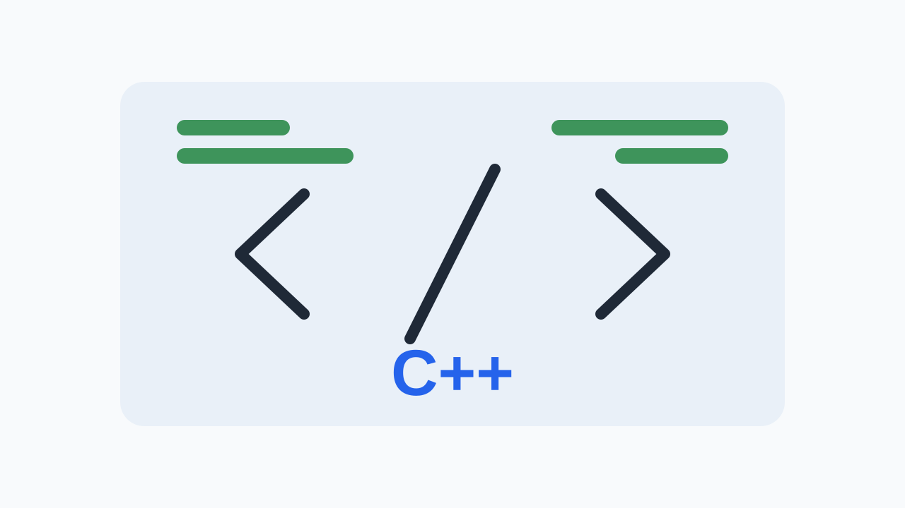

# Camera HAL SW Newsletter - 2026-05-03

이번 주 뉴스레터는 Android의 새로운 AI 기능 통합, 개발 생산성 향상을 위한 도구, 그리고 Camera HAL 개발에 필수적인 AOSP 및 CameraX 업데이트를 다룹니다. AI 기능이 카메라 파이프라인에 미치는 영향과 네이티브 C++ 성능 최적화 방안을 중심으로 기술 동향을 파악하고 실무 적용 방안을 모색합니다.

## 1. 이번 주 3줄 브리핑
- Android의 하이브리드 추론 API와 Gemini 모델 지원 확대로 카메라 기반 AI 기능 구현 가능성이 높아졌습니다. HAL 레벨에서의 NPU/GPU 활용 및 데이터 파이프라인 연동 방안을 검토해야 합니다.
- Android CLI 도구와 AI 에이전트 통합으로 개발 생산성이 향상될 것으로 기대됩니다. Camera HAL 개발 워크플로우 자동화 및 테스트 효율성 증대 방안을 모색합니다.
- AOSP 및 CameraX의 지속적인 업데이트는 HAL 인터페이스, 메타데이터, 스트림 구성에 영향을 줄 수 있습니다. 최신 문서를 주기적으로 확인하고 호환성 테스트를 강화해야 합니다.

## 2. AI

### Android의 하이브리드 추론 및 Gemini 모델 지원 강화

_Image: [Android Developers Blog](https://blogger.googleusercontent.com/img/b/R29vZ2xl/AVvXsEgoPylOD-Ekyhe8AVg3iMvz6S1rsvUT_2Eb4m-77FRH4eebi5psKE8VJwu6xVxCzKXyTXpoxb3-k04e21C6-8KX0BQw0qiCBGToSHJzVYQRckBYqby9csdOCHWp_23DTfPOpWqfjFTL-vJh86Q-DhGLZnbs1L62q4iUsaHHWlpQ2oyLXo3OO0rGsH9ngxw/s1600/Hybrid%20inference%20solution%20for%20Android%20%20-%20Meta.png)_

**이번 주 확인한 사실**

- Firebase AI Logic API는 온디바이스와 클라우드 추론을 결합하는 하이브리드 추론을 지원합니다.
- 새로운 Gemini 모델, 특히 이미지 생성을 위한 Nano Banana 모델 지원이 추가되었습니다.

**배경지식**

Android 플랫폼은 온디바이스 AI 처리 능력과 클라우드 기반 AI 서비스의 장점을 결합하여 더욱 강력하고 유연한 AI 기능을 앱 개발자에게 제공하고 있습니다. Gemini 모델은 Google의 최신 AI 모델 제품군으로, 다양한 작업에서 뛰어난 성능을 보입니다.

**Camera HAL 관점 해석**

하이브리드 추론 API는 카메라 HAL이 특정 AI 연산을 온디바이스 NPU/GPU에서 처리하도록 하거나, 더 복잡한 연산을 위해 클라우드로 데이터를 전송하도록 결정하는 데 영향을 줄 수 있습니다. Gemini Nano 모델 지원은 저전력 온디바이스 추론을 위한 모델 최적화 및 통합을 요구할 수 있습니다. 카메라 스트림 설정 시 AI 추론을 위한 특정 형식(예: YUV, PRIVATE)의 버퍼 할당 및 처리가 필요할 수 있습니다.

**우리 팀이 확인할 Action Item**

- Android 14 이상 기기에서 Preview + AI Inference 스트림 조합으로 10분간 촬영 시 프레임 드롭률 및 평균 FPS를 측정합니다.
- AI 추론을 위한 YUV 420 8bit 스트림 설정 시, HAL 레벨에서 발생하는 버퍼 복사 또는 변환 오버헤드를 분석합니다.

**팀 공유용 한 줄**

새로운 AI 기능 통합은 카메라 파이프라인 최적화 및 하드웨어 활용 방안을 재검토하게 합니다.

**Sources**

- [Hybrid inference and new AI models are coming to Android](https://android-developers.googleblog.com/2026/04/Hybrid-inference-and-new-AI-models-are-coming-to-Android.html)

---

## 3. Tooling

### AI 에이전트 통합으로 Android 앱 개발 생산성 향상

_Image: [Android Developers Blog](https://blogger.googleusercontent.com/img/b/R29vZ2xl/AVvXsEgPyFElAHYM4meoiCciQQ2lncUtR6wtpR1c8Sd1K4SbNEUKDat7QeDRM3yGyMMu0J--WblBE3U09p2W6BMqbVjHysCaNZl8lmhcWr3xFkOhZmk4AXhT77UDU_50fkmzaSbhntd4FRMIdDILFUiSpwJ9abWPTOBaK9I7mC1oxMOwWg1CG3VDDq27EBB2n0o/s4097/hours-CLI_Dark-meta@2x.png)_

**이번 주 확인한 사실**

- Android CLI 도구와 새로운 리소스가 개발 생산성 향상을 위해 출시되었습니다.
- Gemini, Antigravity, Claude Code, Codex 등 다양한 AI 에이전트와의 통합을 지원합니다.

**배경지식**

최근 AI 기술 발전은 소프트웨어 개발 전반에 걸쳐 생산성 향상을 위한 새로운 도구와 워크플로우를 제시하고 있습니다. Android 개발 생태계 역시 이러한 변화에 발맞춰 AI 에이전트를 활용하여 코드 생성, 디버깅, 테스트 자동화 등을 지원하려는 움직임을 보이고 있습니다.

**Camera HAL 관점 해석**

새로운 Android CLI 도구와 AI 에이전트 통합은 Camera HAL 개발 환경에도 긍정적인 영향을 미칠 수 있습니다. 예를 들어, HAL 인터페이스의 일부를 자동으로 생성하거나, 특정 카메라 시나리오에 대한 CTS/VTS 테스트 케이스 초안을 작성하는 데 활용될 수 있습니다. 또한, 복잡한 카메라 메타데이터 처리 로직이나 버퍼 관리 코드의 효율적인 구현을 위한 제안을 받을 수도 있습니다.

**우리 팀이 확인할 Action Item**

- AI 에이전트를 사용하여 특정 카메라 스트림 구성(예: 4K@60fps YUV + JPEG 캡처)에 대한 Camera HAL 초기화 코드 초안을 생성하고, 생성된 코드의 컴파일 및 기본 동작을 확인합니다.
- AI 에이전트에게 Camera HAL에서 자주 발생하는 Binder 통신 오류 로그를 분석하도록 요청하고, 제안된 해결책의 유효성을 검증합니다.

**팀 공유용 한 줄**

AI 기반 개발 도구 활용은 Camera HAL 개발 워크플로우의 효율성을 높이고 반복 작업을 줄이는 데 기여할 수 있습니다.

**Sources**

- [Build Android apps 3x faster using any agent](https://android-developers.googleblog.com/2026/04/build-android-apps-3x-faster-using-any-agent.html)

---

## 4. Android Camera

### AOSP Camera 프레임워크 핵심 문서 업데이트 및 검토

_Image: [AOSP Camera Documentation](https://source.android.com/static/docs/core/camera/images/ape_fwk_hal_camera.png)_

**이번 주 확인한 사실**

- AOSP Camera 문서 페이지는 Camera HAL 및 Android Camera 프레임워크에 대한 주요 정보 소스입니다.
- 현재 페이지에 특정 릴리스 노트나 변경 사항이 명시적으로 기재되어 있지는 않습니다.

**배경지식**

Android Camera HAL은 카메라 하드웨어와 Android 프레임워크 사이의 인터페이스 역할을 하며, 복잡한 스트림 구성, 메타데이터 처리, 요청/결과 관리를 담당합니다. AOSP Camera 문서는 이러한 HAL 구현의 기반이 되는 프레임워크의 동작 방식과 요구사항을 이해하는 데 필수적입니다.

**Camera HAL 관점 해석**

AOSP Camera 문서는 HAL 인터페이스 정의, Camera API 레벨별 기능, 메타데이터 태그의 의미와 사용법, 스트림 구성 및 버퍼 관리 지침 등 HAL 구현에 필요한 핵심 정보를 제공합니다. 예를 들어, 새로운 센서 타입 지원이나 멀티 카메라 기능 강화와 같은 프레임워크 변경은 HAL 레벨에서의 구현 및 메타데이터 처리에 영향을 줄 수 있습니다. 문서의 아키텍처 다이어그램은 HAL과 프레임워크 간의 데이터 흐름을 이해하는 데 도움을 줍니다.

**우리 팀이 확인할 Action Item**

- Android 14 (API 레벨 34) 기준의 AOSP Camera 문서를 검토하고, 이전 버전 대비 변경된 스트림 구성 관련 API 또는 메타데이터 요구사항을 3가지 이상 식별합니다.
- 문서에 설명된 `ANDROID_REQUEST_AVAILABLE_CAPABILITIES` 중 'PRIVACY_LEVEL' 관련 내용을 분석하고, HAL 레벨에서의 지원 방안을 검토합니다.

**팀 공유용 한 줄**

AOSP Camera 문서는 HAL 개발의 기본 참조 자료이므로, 지속적인 검토를 통해 프레임워크 변경 사항을 파악해야 합니다.

**Sources**

- [Camera | Android Open Source Project](https://source.android.com/docs/core/camera)

---

## 5. Android Camera

### CameraX 릴리스 노트 검토 및 HAL 영향 분석

_Image: [CameraX Release Notes](https://developer.android.com/static/images/social/android-developers.png?hl=id)_

**이번 주 확인한 사실**

- CameraX 릴리스 노트 페이지는 Jetpack 라이브러리 업데이트 정보를 제공합니다.
- 현재 페이지에 CameraX의 특정 버전별 상세 변경 사항은 기재되어 있지 않습니다.

**배경지식**

CameraX는 Android 카메라 개발을 간소화하기 위한 Jetpack 라이브러리로, Camera HAL의 복잡성을 추상화하여 앱 개발자가 더 쉽게 카메라 기능을 사용할 수 있도록 합니다. CameraX의 업데이트는 종종 하위 Camera HAL의 기능이나 동작 방식에 대한 새로운 요구사항을 반영하거나, 기존 HAL 기능의 사용 방식을 변경시킬 수 있습니다.

**Camera HAL 관점 해석**

CameraX의 새로운 기능 지원은 HAL 인터페이스, 메타데이터 태그, 또는 스트림 구성 방식에 대한 변경을 요구할 수 있습니다. 예를 들어, CameraX가 특정 센서 정보를 활용하는 새로운 API를 도입한다면, HAL은 해당 정보를 정확하게 제공해야 합니다. 또한, CameraX의 라이브러리 업데이트는 특정 Android 버전 또는 기기 클래스에서만 지원되는 HAL 기능을 활용할 수 있으며, 이에 대한 HAL의 호환성 및 안정성 확보가 중요합니다.

**우리 팀이 확인할 Action Item**

- 최근 6개월 내 CameraX 릴리스 노트에서 언급된 주요 기능 변경 사항 2가지 이상을 식별하고, 각 변경 사항이 Camera HAL의 어떤 부분(예: `captureRequest`, `captureResult`, `stream configuration`)에 영향을 미칠 수 있는지 분석합니다.
- CameraX의 ImageAnalysis Use Case와 VideoCapture Use Case를 동시에 사용하는 시나리오에서, HAL 레벨의 YUV 스트림 버퍼 처리가 효율적인지 Profiler를 사용하여 측정합니다.

**팀 공유용 한 줄**

CameraX 업데이트는 HAL 기능 지원 및 호환성 요구사항에 영향을 주므로, 지속적인 모니터링이 필요합니다.

**Sources**

- [CameraX | Jetpack | Android Developers](https://developer.android.com/jetpack/androidx/releases/camera)

---

## 6. C++

### C++ 성능 최적화: Devirtualization 및 Static Polymorphism 이해

_Image: [ISO C++ Blog](https://isocpp.org/files/img/rosa-devirtualization.png)_

**이번 주 확인한 사실**

- 가상 디스패치는 객체 지향 설계에서 다형성을 가능하게 하지만 성능 오버헤드를 수반합니다.
- Devirtualization 및 Static Polymorphism은 가상 디스패치 오버헤드를 제거하는 데 사용될 수 있는 기법입니다.

**배경지식**

네이티브 C++ 코드로 작성되는 Camera HAL은 실시간 처리 성능이 매우 중요합니다. 객체 지향 설계는 코드의 재사용성과 유지보수성을 높이지만, 가상 함수 호출과 같은 다형성 메커니즘은 런타임 성능에 영향을 줄 수 있습니다. 컴파일러 최적화 기법은 이러한 성능 병목 현상을 완화하는 데 도움을 줄 수 있습니다.

**Camera HAL 관점 해석**

Camera HAL 구현 시, 클래스 상속 구조나 가상 함수 사용이 불가피한 경우가 있습니다. 이 글에서 설명하는 Devirtualization 기법은 컴파일러가 런타임에 가상 함수 호출을 일반 함수 호출로 대체하여 성능을 향상시키는 원리를 이해하는 데 도움을 줍니다. Static Polymorphism은 템플릿 메타프로그래밍 등을 통해 컴파일 타임에 다형성을 구현하는 방식으로, Camera HAL의 특정 모듈에서 성능이 중요한 부분에 적용될 수 있습니다. 이를 통해 카메라 요청 처리, 메타데이터 파싱, 버퍼 관리 등의 핵심 로직에서 성능을 개선할 수 있습니다.

**우리 팀이 확인할 Action Item**

- Camera HAL의 `CameraDevice` 클래스에서 가상 함수 호출이 발생하는 주요 경로를 식별하고, 해당 경로의 성능을 프로파일링하여 병목 지점을 찾습니다. (2주 내)
- 테스트 기기에서 Camera HAL 빌드 시 컴파일러 최적화 레벨을 조정하고, Preview 스트림의 FPS 변화를 측정하여 Devirtualization 효과를 간접적으로 확인합니다. (2주 내)

**팀 공유용 한 줄**

C++ 성능 최적화 기법 이해는 Camera HAL의 실시간 처리 성능 확보에 필수적입니다.

**Sources**

- [Devirtualization and Static Polymorphism](https://isocpp.org//blog/2026/04/devirtualization-and-static-polymorphism-david-alvarez-rosa)

---

## 7. Android Camera

### AOSP 'What's New' 페이지를 통한 최신 동향 파악

_Image: [AOSP What's New / Release Notes](https://www.gstatic.com/devrel-devsite/prod/v579073a50c63499824df5a68b8922367066583d283ef78fdade1028efdb4ceb5/androidsource/images/lockup.png)_

**이번 주 확인한 사실**

- AOSP 'What's New' 페이지는 Android Open Source Project의 최신 업데이트 정보를 제공하는 공식 소스입니다.
- 현재 페이지에 특정 릴리스 노트나 상세 변경 사항이 명시적으로 기재되어 있지는 않습니다.

**배경지식**

Android Open Source Project(AOSP)는 Android 운영체제의 오픈 소스 기반이며, 카메라 프레임워크, HAL, 관련 라이브러리를 포함한 시스템 전반의 업데이트가 이곳에서 이루어집니다. AOSP의 변경 사항은 Camera HAL 개발 및 테스트에 직접적인 영향을 미칠 수 있습니다.

**Camera HAL 관점 해석**

AOSP 'What's New' 페이지를 통해 카메라 프레임워크 API 변경, 새로운 메타데이터 태그 추가, 스트림 구성 관련 제약 조건 변경, 또는 보안 업데이트 등 Camera HAL에 영향을 줄 수 있는 변경 사항을 조기에 인지할 수 있습니다. 예를 들어, 특정 Android 버전에서 Camera2 API의 동작 방식 변경이나 새로운 기능 지원이 발표된다면, HAL은 이에 맞춰 업데이트되어야 합니다. 이 페이지는 CameraX나 Android 프레임워크의 주요 업데이트와 연계하여 Camera HAL의 대응 방안을 모색하는 데 기초 자료가 됩니다.

**우리 팀이 확인할 Action Item**

- 최근 3개월간 AOSP 'What's New' 페이지에서 카메라 관련 변경 사항을 2건 이상 식별하고, 각 변경 사항이 Camera HAL의 특정 API 또는 메타데이터에 미치는 잠재적 영향을 분석합니다.
- AOSP 'What's New' 페이지에서 언급된 Android 15 (가상) 카메라 관련 기능 중, HAL 레벨에서 지원이 필요한 항목을 1가지 이상 선정하여 관련 AOSP 문서(예: Camera HAL 문서)에서 추가 정보를 확인합니다.

**팀 공유용 한 줄**

AOSP 'What's New' 페이지는 Camera HAL 개발에 영향을 줄 수 있는 전반적인 AOSP 변경 사항을 파악하는 데 중요합니다.

**Sources**

- [What's new | Android Open Source Project](https://source.android.com/docs/whatsnew)

---

## 8. C++

### GCC 16.1 릴리스: C++26 기능 및 C++20 기본값 적용

_Image: [GCC 16.1 released: C++26 reflection / contracts / safety hardening, C++20 by default, and more!](https://isocpp.org//blog/2026/04/gcc-16.1)_

**이번 주 확인한 사실**

- GCC 16.1 버전이 출시되었습니다.
- GCC 16.1은 기본적으로 C++20 표준을 사용합니다.
- C++26의 Reflection 및 Contracts와 같은 실험적인 기능 지원이 추가되었습니다 (예: `-std=c++26 -freflection` 옵션).

**배경지식**

GCC(GNU Compiler Collection)는 널리 사용되는 오픈 소스 컴파일러 모음으로, C++ 표준의 발전에 따라 새로운 언어 기능을 지원하기 위해 지속적으로 업데이트됩니다. C++20 및 C++26과 같은 최신 표준은 개발자가 더 안전하고 표현력 있는 코드를 작성할 수 있도록 돕습니다.

**Camera HAL 관점 해석**

Camera HAL 개발에서 GCC 컴파일러를 사용하는 경우, C++20 표준 기능(예: Concepts, Ranges)을 활용하여 코드의 가독성과 안정성을 높일 수 있습니다. C++26의 Reflection 기능은 Camera HAL이 동적으로 카메라 장치 정보를 쿼리하거나, 복잡한 메타데이터 구조를 다룰 때 유용하게 사용될 수 있습니다. 다만, 이러한 최신 C++ 기능은 컴파일러 지원뿐만 아니라 Android 빌드 시스템과의 통합 및 런타임 환경에서의 호환성도 고려해야 합니다. 현재 Android NDK는 Clang/LLVM 기반이므로, GCC의 최신 C++ 기능 지원이 HAL 개발에 직접 적용되기까지는 추가적인 검토가 필요할 수 있습니다.

**우리 팀이 확인할 Action Item**

- Camera HAL의 특정 모듈(예: 3A 통계 처리)에 C++20 Concepts를 적용하여 코드의 가독성과 타입 안전성을 개선하는 예제를 작성하고, 컴파일 오류 및 런타임 동작을 확인합니다. (2주 내)
- GCC 16.1 컴파일러를 사용하여 C++26 Reflection 기능을 포함하는 간단한 C++ 코드를 작성하고, 해당 코드가 Android 환경에서 컴파일 및 실행 가능한지 기본적인 테스트를 수행합니다. (2주 내)

**팀 공유용 한 줄**

GCC의 최신 C++ 표준 지원은 Camera HAL 개발의 표현력과 안정성을 향상시킬 잠재력이 있습니다.

**Sources**

- [GCC 16.1 released: C++26 reflection / contracts / safety hardening, C++20 by default, and more!](https://isocpp.org//blog/2026/04/gcc-16.1)

## 이번 주 Action Items

- Android 14 이상 기기에서 Preview + AI Inference 스트림 조합으로 10분간 촬영 시 프레임 드롭률 및 평균 FPS를 측정합니다.
- AI 추론을 위한 YUV 420 8bit 스트림 설정 시, HAL 레벨에서 발생하는 버퍼 복사 또는 변환 오버헤드를 분석합니다.
- 최근 6개월 내 CameraX 릴리스 노트에서 언급된 주요 기능 변경 사항 2가지 이상을 식별하고, 각 변경 사항이 Camera HAL의 어떤 부분에 영향을 미칠 수 있는지 분석합니다.
- Camera HAL 코드에서 가상 함수 호출이 많이 사용되는 부분을 식별하고, 해당 함수의 호출 빈도와 성능 영향을 측정합니다.
- Camera HAL의 `CameraDevice` 클래스에서 가상 함수 호출이 발생하는 주요 경로를 식별하고, 해당 경로의 성능을 프로파일링하여 병목 지점을 찾습니다.
- 최근 3개월간 AOSP 'What's New' 페이지에서 카메라 관련 변경 사항을 2건 이상 식별하고, 각 변경 사항이 Camera HAL의 특정 API 또는 메타데이터에 미치는 잠재적 영향을 분석합니다.

## References

- [Hybrid inference and new AI models are coming to Android](https://android-developers.googleblog.com/2026/04/Hybrid-inference-and-new-AI-models-are-coming-to-Android.html)
- [Build Android apps 3x faster using any agent](https://android-developers.googleblog.com/2026/04/build-android-apps-3x-faster-using-any-agent.html)
- [Camera | Android Open Source Project](https://source.android.com/docs/core/camera)
- [CameraX | Jetpack | Android Developers](https://developer.android.com/jetpack/androidx/releases/camera)
- [Devirtualization and Static Polymorphism](https://isocpp.org//blog/2026/04/devirtualization-and-static-polymorphism-david-alvarez-rosa)
- [What's new | Android Open Source Project](https://source.android.com/docs/whatsnew)
- [GCC 16.1 released: C++26 reflection / contracts / safety hardening, C++20 by default, and more!](https://isocpp.org//blog/2026/04/gcc-16.1)
- [Camera HAL SW Newsletter Editorial Policy](docs/editorial-policy.md)
- [Camera HAL SW Newsletter Template](docs/newsletter-template.md)
